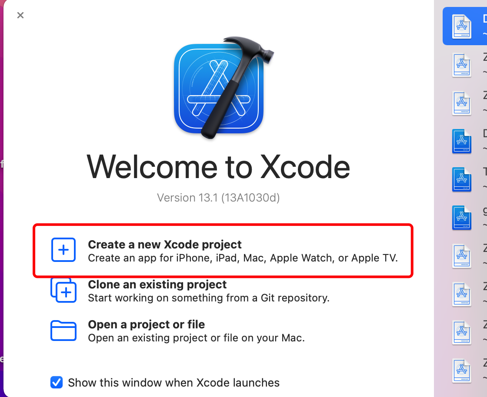
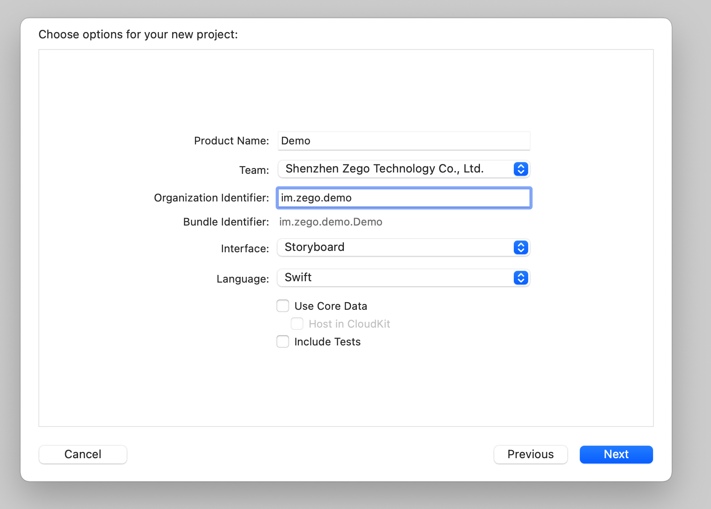
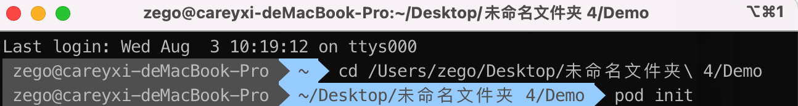
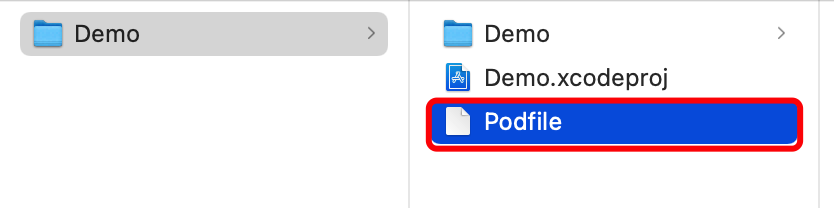
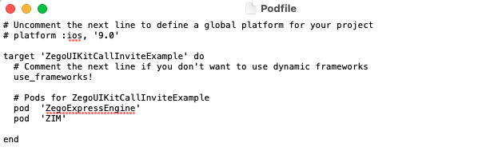
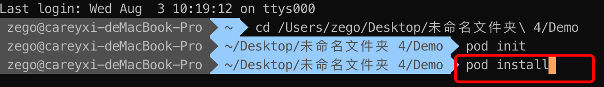
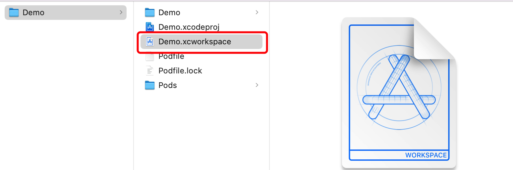
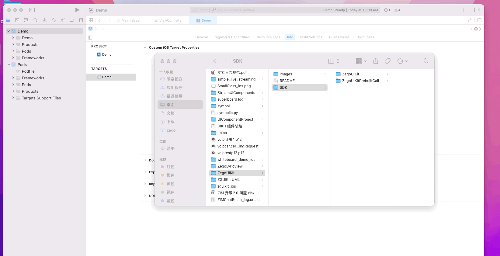
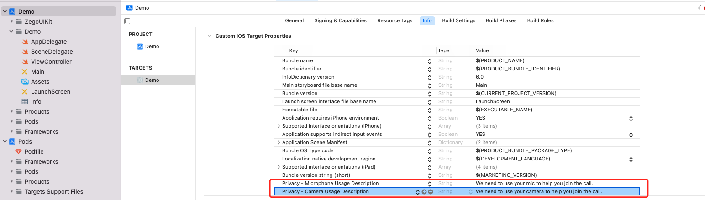

##  How to integrate ZegoUIKit into your project

<!--Now only supports using local package references to integrate ZegoUIKit. (Since it is currently in the beta testing stage, the cocoapods package management has not been uploaded yet)-->

In this document, we create a brand new iOS app project to introduce how to integrate






### Install Pods

1. Open Terminal, navigate to the `Demo` folder and run the `pod init` command.




2. Add dependencies for ZegoUIkit `pod 'ZegoExpressEngine'` `pod 'ZIM'`






3. Run the `pod install` command to install all dependencies that are needed.

   


### Add ZegoUIKit for  project

1. Open `.xcworkspace` file in Xcode

   

2. Unzip ZegoUIKit.zip and place it at the same level as your project's root dir†ectory



3. Configure camera and microphone permission support in the info.plist file

    

### integrated ZegoUIKitPrebuiltCall

<!--you need to fill in the appID and appSign you obtained from [zegocloud console](https://console.zegocloud.com/). You can customize the roomID arbitrarily, just need to know: users in the same room can talk to each other. (Currently ZegoUIKit only supports 1v1 call, and will support group call soon)-->


```swift
class ViewController: UIViewController {

  override func viewDidLoad() {

	   super.viewDidLoad()
	   // Do any additional setup after loading the view.
  }

  @IBAction func startCall(_ sender: Any) {
    let config: ZegoUIkitPrebuiltCallConfig = ZegoUIkitPrebuiltCallConfig()
    let callVC: ZegoUIKitPrebuiltCallVC = ZegoUIKitPrebuiltCallVC.init(YOUR_APPID, appSign: YOUR_APP_Sign, userID: "userID", userName: "UserName", callID: "callID", config: config)
    callVC.modalPresentationStyle = .fullScreen
    callVC.delegate = self
    self.present(callVC, animated: true, completion: nil)     
  }
}

extension ViewController: ZegoUIKitPrebuiltCallVCDelegate {
    func onHangUp(_ isHandup: Bool) {
        // Triggered when hanging up 
    }
    
    func getForegroundView(_ userInfo: ZegoUIkitUser?) -> UIView? {
        // You can add your custom ForegroundView on top of AudioVideoView here
    }
    
    func onOnlySelfInRoom() {
        //You're the only person on the line right now
    }
    
}
```


### Feature tips

1. Support clicking on the unresponsive area to hide the menuBar
2. Support display sound waves in audio call mode
3. Support clicking on the small view to exchange it with the large view
4. Support dragging small view position

For more features, see Advanced config property list


##  Customize

1. Customize backgroundImage of audio video view

   ```swift
   //Set before initializing ZegoUIKitPrebuiltCallVC
   let config: ZegoUIkitPrebuiltCallConfig = ZegoUIkitPrebuiltCallConfig()
   let layoutConfig: ZegoLayout = ZegoLayout()
   let pictureInPictureConfig: ZegoLayoutPictureInPictureConfig = ZegoLayoutPictureInPictureConfig()
   pictureInPictureConfig.bigViewBackgroundImage = YOUR_CUSTOM_IMAGE// set your custom image
   pictureInPictureConfig.smallViewBackgroundImage = YOUR_CUSTOM_IMAGE // set your custom image
   layoutConfig.config = pictureInPictureConfig
   layoutConfig.mode = .pictureInPicture
   config.layout = layoutConfig
   ```

2. Customize backgroundColor of audio video view

   ```swift
   //Set before initializing ZegoUIKitPrebuiltCallVC
   let config: ZegoUIkitPrebuiltCallConfig = ZegoUIkitPrebuiltCallConfig()
   let layoutConfig: ZegoLayout = ZegoLayout()
   let pictureInPictureConfig: ZegoLayoutPictureInPictureConfig = ZegoLayoutPictureInPictureConfig()
   pictureInPictureConfig.bigViewBackgroundColor = YOUR_CUSTOM_IMAGE// set your custom image
   pictureInPictureConfig.smallViewBackgroundColor = YOUR_CUSTOM_IMAGE // set your custom image
   layoutConfig.config = pictureInPictureConfig
   layoutConfig.mode = .pictureInPicture
   config.layout = layoutConfig
   ```

   

3. Customize foreground of audio video view

   ```swift
   class ViewController: UIViewController {
     
     func startCall() {
       let callVC: ZegoUIKitPrebuiltCallVC = ZegoUIKitPrebuiltCallVC.init(YOUR_APPID, appSign: "YOUR_APP_Sign", 		 		userID: "userID", userName: "UserName", callID: "callID", config: config)
   		 callVC.delegate = self //set delegate
     }
     
   }
   
   //Implementing the proxy method
   extension ViewController: ZegoUIKitPrebuiltCallVCDelegate {
       func getForegroundView(_ userInfo: ZegoUIkitUser?) -> UIView? {
           let customView: UIView = UIView()
           return customView
       }
   }
   ```

   

4. Customize buttons of menu bar

   ```swift
   //Set before initializing ZegoUIKitPrebuiltCallVC
   let config: ZegoUIkitPrebuiltCallConfig = ZegoUIkitPrebuiltCallConfig()
   config.menuBarButtons = [.quitButton,.swtichAudioOutputButton,.toggleMicrophoneButton]
   ```

5. Add system  button to Menubar

   ```swift
   let callVC: ZegoUIKitPrebuiltCallVC
   let button: UIButton = UIButton()
   button.addTarget(self, action: #selector(buttonClick), for: .touchUpInside)
   callVC.addButtonToMenuBar(button)
   
   @objc func buttonClick() {
        // button click event
   }
   ```

6. Add component  button to Menubar

   ```swift
   let callVC: ZegoUIKitPrebuiltCallVC
   let button: ZegoLeaveButton = ZegoLeaveButton()
   callVC.addButtonToMenuBar(button)
   ```

   

##  Advanced config

You can modify more advanced config property like `config.turnOnCameraWhenJoining = false;`, usage demo:

```swift
//Set before initializing ZegoUIKitPrebuiltCallVC
let config: ZegoUIkitPrebuiltCallConfig = ZegoUIkitPrebuiltCallConfig()
config.turnOnCameraWhenjoining = false
let callVC: ZegoUIKitPrebuiltCallVC =  ZegoUIKitPrebuiltCallVC.init(YOUR_APPID, appSign: "YOUR_APP_Sign", userID: "userID", userName: "UserName", callID: "callID", config: config)
```


###  Advanced config property list

| **variable name**           | **type**                    | **default value**                                            | **comment**                                                  |
| :-------------------------- | --------------------------- | :----------------------------------------------------------- | :----------------------------------------------------------- |
| turnOnCameraWhenJoining     | Bool                        | true                                                         | whether to enable the camera by default, the default value is true |
| turnOnMicrophoneWhenJoining | Bool                        | true                                                         | whether to enable the microphone by default, the default value is true |
| useSpeakerWhenJoining       | Bool                        | false                                                        | whether to use the speaker by default, the default value is false; |
| showSoundWaveOnAudioView    | Bool                        | true                                                         | Whether to display the sound waves around the profile picture in voice mode |
| showMicrophoneStateOnView   | Bool                        | true                                                         | Used to control whether the default MicrophoneStateIcon for the prebuilt layer is displayed on VideoView. |
| showCameraStateOnView       | Bool                        | true                                                         | Used to control whether the default CameraStateIcon for the prebuilt layer is displayed on VideoView. |
| showUserNameOnView          | Bool                        | true                                                         | Used to control whether the default UserNameLabel for the prebuilt layer is displayed on VideoView |
| layout                      | ZegoLayout                  | ZegoLayoutPictureInPictureConfig()                           | The default layout is a picture-in-picture layout            |
| hangUpConfirmInfo           | ZegoHangUpConfirmDialogInfo | ZegoHangUpConfirmDialogInfo()                                | alert dialog information of quit. if confirm info is not null, APP will pop alert dialog when you quit |
| isMenuBarHideAutomatically  | Bool                        | true                                                         | if true, menu bars will collapse after stand still for 5 seconds |
| isMenuBarHideByClick        | Bool                        | true                                                         | if true, menu bars will collapse when clicks on blank spaces |
| menuBarButtons              | [ZegoMenuBarButtonType]     | [<br />.toggleCameraButton,<br />.toggleMicrophoneButton,<br />.quitButton,<br />.swtichAudioOutputButton,<br />.swtichCameraFacingButton<br /<br />] | these buttons will displayed on the menu bar, order by the list |
| menuBarButtonsLimitedCount  | Int                         | 5                                                            | limited item count display on menu bar, if this count is exceeded, More button is displayed |


###  Advanced layout config

Each layout has some configurable parameters for you to choose

ZegoLayoutPictureInPictureConfig:


| **variable name**         | **type**         | **default value** | **comment**                                                  |
| ------------------------- | ---------------- | ----------------- | ------------------------------------------------------------ |
| isSmallViewDraggable      | Bool             | false             | Whether the small View is dragable.                          |
| showSelfViewWithVideoOnly | Bool             | false             | A value of true indicates that the small View is displayed only when the camera is enabled. Otherwise, the small View is always present. If you are in a large View, this parameter does not take effect |
| smallViewBackgroundColor  | UIColor          | gray              | Background color of the small View during a voice call       |
| bigViewBackgroundColor    | UIColor          | gray              | Background color of the large View during a voice call       |
| smallViewBackgroundImage  | UIImage          | nil               | During a voice call, the background image of the small View has a higher priority than the background color |
| bigViewBackgroundImage    | UIImage          | nil               | During a voice call, the background image in the large View has a higher priority than the background color |
| smallViewPostion          | ZegoViewPosition | .topRight         | The default position of the small View                       |
| useVideoViewAspectFill    | Bool             | false             | Default false, normal black edge mode                        |


#  test tips

1. you need use real device to test, ios simulator doesn't support camera.
2. Please note that the two devices should not be very close to each other when testing, if your two devices are close to each other, there may be a problem with capturing each other's voices, causing echo oscillations. see https://en.wikipedia.org/wiki/Audio_feedback

